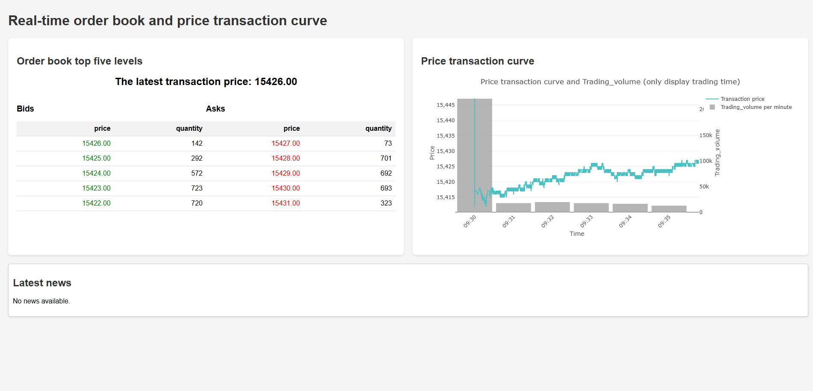

# MarketSim: Simulating Stock Markets with Large-Scale Generative Agents

> Stock markets are one of the most complex systems in the modern world, where prices emerge from billions of decentralized interactions among heterogeneous participants in an ever-evolving information landscape. Building a high-fidelity stock market simulator is not only a cornerstone for understanding such complexity, but also offers a valuable testbed for anticipating and mitigating crises and disruptions. Despite decades of efforts, existing methods remain confined to an unresolved dilemma: structural fidelity often comes at the cost of non-intelligent agents, while LLM-empowered agents can only participate in oversimplified market environments. To this end, we propose MarketSim, a large-scale stock market simulation framework that addresses the dilemma between behavioral and structural fidelity. Specifically, we first design a hierarchical multi-agent architecture. By decoupling agents’ strategic reasoning from their high-frequency actions, this architecture enables LLM-powered agents to participate in a nanosecond-resolution, NASDAQ-like continuous double auction market. Building on this, we simulate over 15k diverse market participant agents, whose billions of interactions collectively create an evolving market environment in which agents learn from feedback and adapt their strategies accordingly. Furthermore, we ground these agents in a rich informational landscape that covers over 12k real-world news articles, policy documents, and earnings reports. To evaluate our proposed MarketSim, we develop a comprehensive benchmark that includes stocks from 8 GICS sectors and 3 representative real-world scenarios, along with 5 stylized facts for market complexity and 5 price-related statistical metrics. Extensive experiments demonstrate that MarketSim not only captures the complexity characterizing real-world markets, but also accurately tracks real-world high-frequency price dynamics with an average MAPE of 3.48\%. Overall, MarketSim not only offers direct applications in understanding and anticipating financial crises, but also provides evidence for a key tenet of complexity science: fidelity breeds complexity.

## 🚀 Quick Start

### Prerequisites

- Python 3.8+
- pip package manager

### Installation

1. **Clone the repository:**
   ```bash
   git clone https://github.com/xxxx-q11/MarketSim
   cd MarketSim
   ```

2. **Install dependencies:**
   ```bash
   pip install -r requirements.txt
   ```

3. **Configure LLM API keys:**
   Edit `config_LLM.py` and add your API keys:
   ```python
   apikeys['deepseek_api_key']="your_api_key_here"
   ```

4. **Run the simulation:**
   ```bash
   python -u abides.py -c rsmtry_LLM3 -t JNJ -d 20250402 -s 1234 -l rmsctry_LLM3 --enable-llm-cache
   ```

## 📋 Command Line Arguments

The main simulation script accepts the following arguments:

| Argument | Description | Example |
|----------|-------------|---------|
| `-c, --config` | Configuration file name | `rsmtry_LLM3` |
| `-t, --ticker` | Stock symbol to simulate | `JNJ` |
| `-d, --historical-date` | Trading date (YYYYMMDD) | `20250402` |
| `-s, --seed` | Random seed for reproducibility | `1234` |
| `-l, --log_dir` | Log directory name | `rmsctry_LLM3` |
| `--enable-llm-cache` | Enable LLM result caching | Flag |
| `--start-time` | Simulation start time | `09:30:00` (default) |
| `--end-time` | Simulation end time | `16:00:00` (default) |

## ��️ Architecture Overview

### Agent Types

MarketSim simulates multiple types of trading agents:

- **LLM Agents(Manager Agents)**: Intelligent institutional investors powered by Large Language Models
- **Noise Agents**: 12,000 agents representing retail traders with random behavior
- **Value Agents**: 100 agents that trade based on fundamental value analysis
- **Trade Agents**: 2,950 agents guided by Manager Agents
- **Market Maker Agents**: Adaptive market makers providing liquidity
- **Momentum Agents**: 50 agents that follow price momentum trends

### Market Infrastructure

- **Exchange Agent**: NASDAQ-like continuous double auction market
- **Order Book**: Nanosecond-resolution order matching
- **Oracle**: LLM-powered data provider

## 🔧 Configuration

### LLM Configuration (`config_LLM.py`)

```python
apikeys = {}
apikeys['deepseek_api_key'] = "your_api_key_here"
apikeys['think_model_name'] = "deepseek-reasoner"
apikeys['generate_model_name'] = "deepseek-chat"

base_agentconfig = {
    "company": "JNJ",
    "event": "Trump"
}
```

### Simulation Parameters

Key simulation parameters can be adjusted in the configuration files:

- **Market Hours**: 09:30:00 - 16:00:00 (configurable)
- **Starting Cash**: $10,000,000 per agent
- **Market Maker Parameters**: POV, spread settings, wake-up frequency

## 📊 Output and Analysis

The simulation generates comprehensive market data including:

- **Order Book Data**: Bid/ask prices and volumes
- **Trade Data**: Transaction records with timestamps
- **Market Statistics**: Volume, volatility, and price dynamics

### Visualization Tools

- `real_time_visualization.py`: Real-time market visualization
- `plot_trade_price.py`: Price movement analysis
- `plot_trade_Comparison.py`: Comparative analysis tools

## 🧪 Experimental Features

### LLM Cache System

Enable caching to improve performance and reduce API costs:
```bash
python -u abides.py -c rsmtry_LLM3 -t JNJ -d 20250402 -s 1234 -l rmsctry_LLM3 --enable-llm-cache
```
If the llm_cache.json file does not exist, create the file and save the return result and its status after each invocation of the Manager Agents for breakpoint recovery
If the file already exists, the previous experiment can be reproduced
### Multiple Trading Days

The system supports simulating multiple consecutive trading days:
```python
trading_days = ["2025-04-02", "2025-04-03", "2025-04-04"]
```
### Dashboard Features

The real-time visualization interface includes:

- **Live Order Book Display**: Real-time bid/ask prices and volumes with top 5 levels
- **Price Movement Chart**: Interactive price-time series with minute-level volume bars
- **News Feed Integration**: Live news updates affecting market sentiment
- **Trading Hours Filtering**: Automatic filtering to display only active trading periods
- **Multi-day Simulation Support**: Seamless visualization across multiple trading days

### Interface Screenshots
```bash
http://localhost:8504
```

*Real-time order book display showing bid/ask levels and latest trade price*


## �� Project Structure


